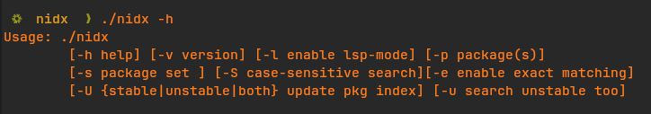
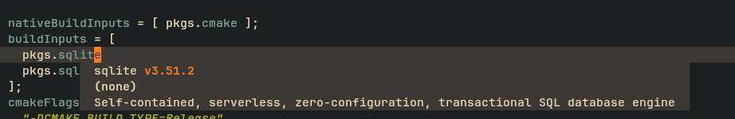
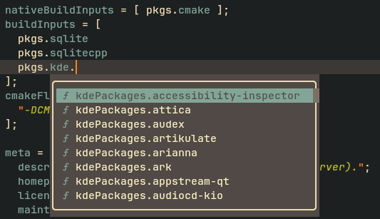
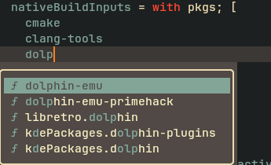
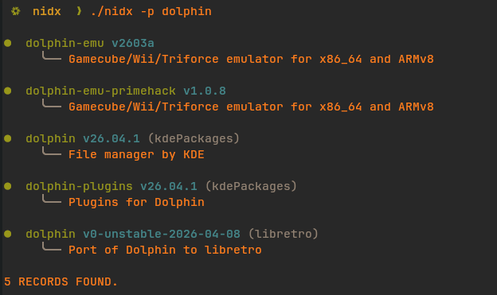
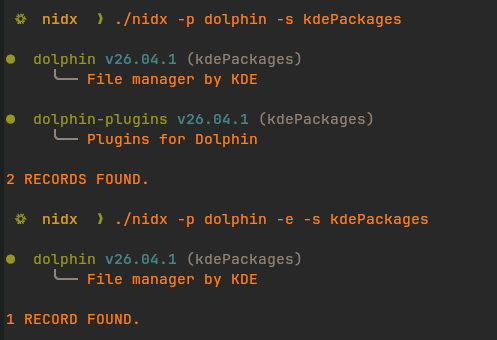
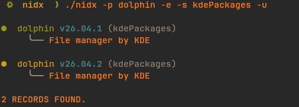
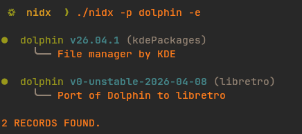
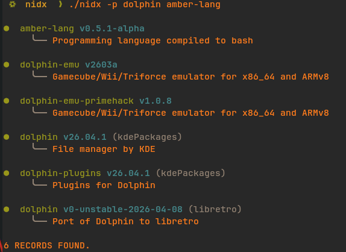

# Nidx
This is a Nix Packages Indexer (Nix Index) providing querying of packages for both stable and unstable channels, and doubles as an LSP server, providing completion and hover capabilities for packages.

It provides
- Fine-tuned search for packages in either/both of the stable and unstable channels of nixpkgs through various flags, shown below
- LSP Completion and hover support, but only for stable channel(unstable support not impl'd).
- Updates to both channels easily (checkout the `Usage` below)
> [!Note]
> `nidx` provides completion and hover capabilities based on a fast local index of upstream nixpkgs channels. It does not evaluate dynamic local configurations, inline overlays and/or custom packages defined within the local workspace/file.
>
> It basically is just [search.nixos.org](search.nixos.org) brought to the editor and CLI with speed.

## Installation
Run directly:
```bash
nix run github:bitflaw/nidx -- <args>
```

Install to profile:
```bash
nix profile install github:bitflaw/nidx

```
or add via flake inputs if on a flake-based system:
```nix
# flake.nix inputs
inputs = {
  nidx.url = "github:bitflaw/nidx";
}

# Inside your configuration:
environment.systemPackages = [ inputs.nidx.packages.${pkgs.system}.nidx ]; # or home.packages in home.nix
```

When first ran, the tool will check if the needed database(s) are existent, if not, it will just fetch the content from nixpkgs. If it does find
the database(s), it won't do anything, even update, until you explicitly tell it to do so.

## Usage



| Flag | Function |
|------|----------|
| -h | print the usage as seen in the picture above |
| -v | get the version of the software |
| -l | enable [LSP mode](#lsp-mode) |
| -p | specify package(s) to search for in the database(s) |
| -s | filter package(s) being searched by a package set (doesn't have to be exact)|
| -S | employ a case-sensitive search for package(s) being searched |
| -e | search the exact package(s) provided by the `-p` flag |
| -u | search for package(s) in both the stable(default search db) and unstable databases |
| -U | update either the stable, unstable or both databases from respective channels |


## LSP Mode

This was implemented as a by-the-way. I figured, well, since I have packages just sitting there, and can be queried quite fast too,
I can get package information in my .nix files as I'm writing them, particularly in times when I'm unsure about say attribute paths, etc.

So I built an LSP server that does exactly that. It provides completion support and hover information for particular zones in .nix files. The
zones are where packages are normally defined. These are `buildInputs`, `nativeBuildInputs`, `home.packages`, `packages`,
`environmemt.systemPackages` and `systemPackages`.
It does the checking quite crudely, isn't that extensible, but I have tried to include the most common zones where packages are defined.

> [!Note]
> This only uses the stable database as it queries for package information for either completion or hover, since I still haven't implemented
> a method of differentiating when a user is using stable or unstable channel in their .nix files.
>
> Also this has **only been tested on neovim**.
> An example of a configuration for neovim using [nvim-lspconfig](https://github.com/neovim/nvim-lspconfig) would be:
> ```lua
> -- Configuration of nidx lsp server
> nidx-config = {
>   name = "nidx",
>   cmd = { "nidx", "-l" },
>   filetypes = { "nix" },
> }
> 
> vim.lsp.config("nidx", nidx-config)
> vim.lsp.enable("nidx")
> ```

Below are some demos on how this looks:
### Hover

### Completion
<table>
    <tr>
        <td></td>
        <td></td>
    </tr>
</table>

### Features yet to introduce to the LSP side of things:
- [ ] Incremental parsing -> I already have tree-sitter integrated, so one would think that this would be a trivial task, but no, so I will try again later
- [ ] Support for both channels (stable and unstable) as they can be used side by side in nix files, eg flake inputs.
- [ ] More Zone coverage, IE identifying where packages are defined or used in files, and adding them as zones in the lsp server, which will then provide completion and hover capability for them.

### More Examples
<table>
    <tr>
        <td></td>
        <td></td>
    </tr>
    <tr>
        <td></td>
        <td></td>
    </tr>
     <tr>
        <td></td>
    </tr>
</table>
